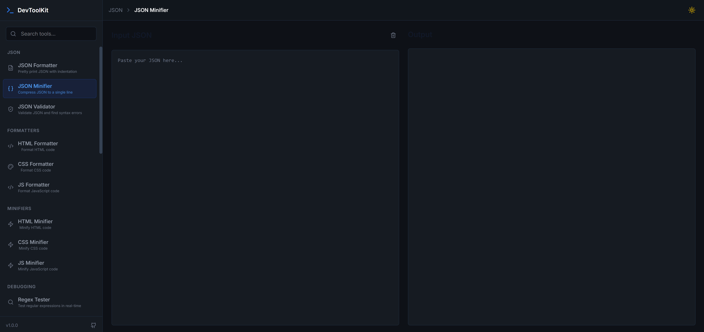

# 💻 Code Helper Toolkit

A fast, lightweight, and beautifully designed collection of **developer tools** to simplify your daily coding workflow — now with a built-in **HTML/CSS/JavaScript compiler** 🚀

---

## 🚀 Live Demo

👉 **Try it here:**
https://devtool-kit.vercel.app/

---

## 📸 Preview



---

## 🚀 Overview

**Code Helper Toolkit** is built for developers, students, and freelancers who need quick access to essential utilities like formatters, generators, converters, debugging tools, and a **live code editor**.

No installs. No setup. Just code and run ⚡

---

## ✨ Features

### 🧑‍💻 Live Code Compiler

* Write and run **HTML, CSS, and JavaScript** in real-time
* Instant preview (like CodePen)
* Split-screen editor + output
* Auto-refresh on changes
* Reset / clear editor
* Copy code

---

### 🧩 Code Formatting & Minification

* JSON Formatter & Validator
* HTML, CSS, JavaScript Formatter
* Code Minifiers

---

### 🔍 Debugging & Testing

* Regex Tester
* Diff Checker
* API Tester (mini Postman)

---

### 🔐 Security & Encoding

* Hash Generator (MD5, SHA-1, SHA-256)
* JWT Decoder
* Base64 Encode / Decode
* URL Encoder / Decoder

---

### 🎨 Frontend Tools

* Color Picker
* HEX ↔ RGB ↔ HSL Converter
* CSS Generators (Shadow, Radius, Glassmorphism)
* Gradient Generator

---

### 🧠 Productivity Tools

* Code Snippets Manager
* Markdown Previewer
* JSON Viewer

---

### 🧮 Utilities

* UUID Generator
* Password Generator
* Timestamp Converter

---

## 🎨 UI & Experience

* 🌗 Dark Mode (default) + Light Mode
* 🔤 Monospace font (JetBrains Mono)
* ⚡ Instant results
* 📋 Copy-to-clipboard everywhere
* 🧼 Clean & distraction-free UI

---

## 📱 Responsive Design

* Fully responsive (mobile + desktop)
* Split-screen editor layout
* Optimized for speed

---

## ⚙️ Tech Stack

* React (Vite)
* Tailwind CSS
* Framer Motion
* Prism.js
* Prettier
* CryptoJS
* Axios

---

## 💾 Local Storage

* Saved snippets
* Theme preference
* Editor state (optional)

---

## 🛠️ How to Run Locally

Follow these steps to run the project on your machine:

### 1. Clone the Repository

```bash
git clone https://github.com/mohakamran/devtool_kit.git
```

### 2. Navigate to Project Folder

```bash
cd devtool_kit
```

### 3. Install Dependencies

```bash
npm install
```

### 4. Start Development Server

```bash
npm run dev
```

### 5. Open in Browser

Visit:

```
http://localhost:5173
```

---

## 🏗️ Build for Production

```bash
npm run build
npm run preview
```

---

## 🌍 Deployment

Deployed on **Vercel**
You can deploy your own version easily by connecting your GitHub repo.

---

## 🎯 Goal

To become a **developer’s all-in-one workspace** — code, test, debug, and build faster.

---

## ⭐ Support

If you like this project:

* Give it a ⭐ on GitHub
* Share it with developers

---

> Code smarter. Build faster. All in one place ⚡
